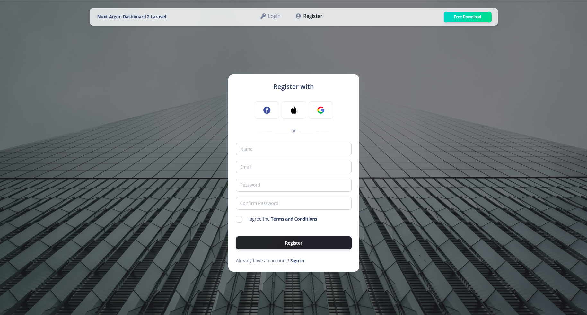
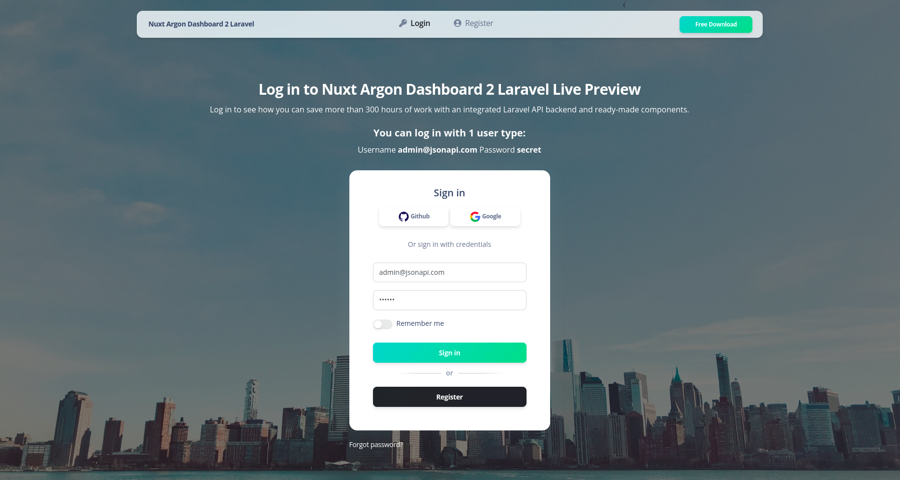
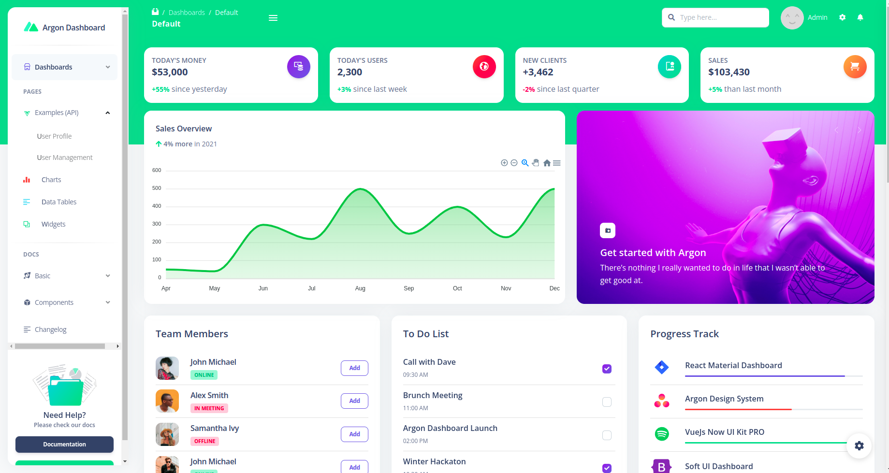
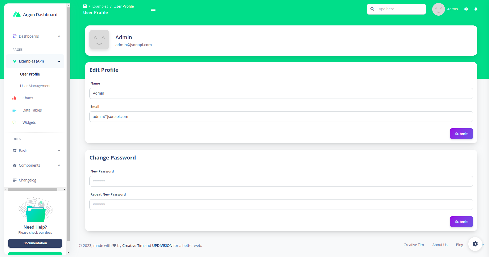
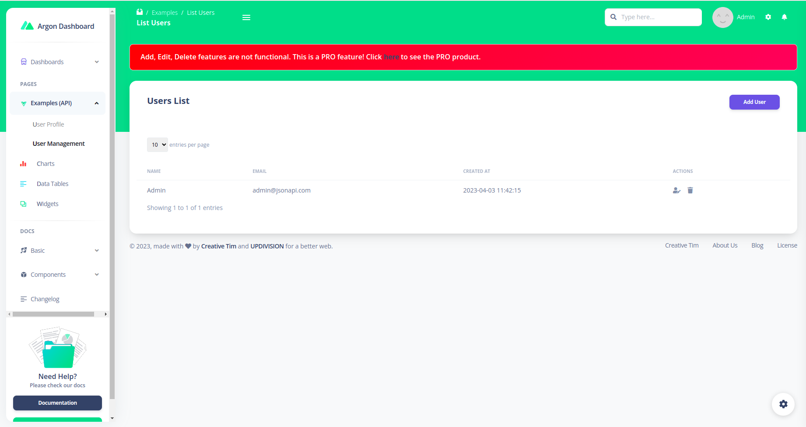
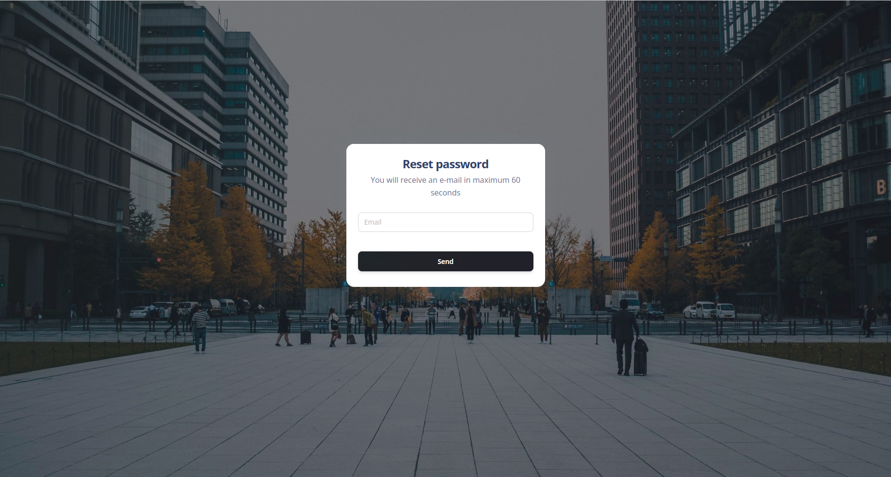

# [Nuxt Argon Dashboard 2 Laravel](http://creative-tim.com/product/nuxt-argon-dashboard-laravel/?ref=readme-nadp) [](https://twitter.com/intent/tweet?url=https://www.creative-tim.com/product/nuxt-argon-dashboard-laravel&text=Check%20Nuxt%Argon%20Dashboard%202%20Pro%20made%20by%20@CreativeTim%20#webdesign%20#dashboard%20#argondesign%20#vue%20https://www.creative-tim.com/product/nuxt-argon-dashboard-laravel)

 [](https://github.com/creativetimofficial/nuxt-argon-dashboard-laravel/issues?q=is%3Aopen+is%3Aissue) [](https://github.com/creativetimofficial/nuxt-argon-dashboard-laravel/issues?q=is%3Aissue+is%3Aclosed)


Start your Development with an Innovative Admin Template for Bootstrap 5 and Nuxt 3. If you like the look & feel of the hottest design trend right now, you will fall in love with this dashboard! It features a huge number of components built to fit together and look amazing.

**Fully Coded Components**<br />
Nuxt Argon Dashboard 2 is built with over 200 frontend individual elements, like buttons, inputs, navbars, nav tabs, cards, or alerts, giving you the freedom of choosing and combining. All components can take variations in color, which you can easily modify using SASS files and classes. You will save a lot of time going from prototyping to full-functional code because all elements are implemented.

This Premium Bootstrap 5 & Nuxt 3 Dashboard is coming with prebuilt design blocks, so the development process is seamless,
switching from our pages to the real website is very easy to be done.

View [all components here](https://www.creative-tim.com/learning-lab/nuxt/alerts/argon-dashboard/).

**Documentation built by Developers**<br />
Each element is well presented in very complex documentation.
You can read more about the [documentation here](https://www.creative-tim.com/learning-lab/nuxt/overview/argon-dashboard/).

**Example Pages**<br />
If you want to get inspiration or just show something directly to your clients, you can jump-start your development with our pre-built example pages. Every page is spaced well, with attractive layouts and pleasing shapes. From specially designed dashboards for smart homes, virtual reality, and automotives to CRM admins, Nuxt Argon Dashboard 2 has everything you need to quickly set up an amazing project.

View [example pages here](https://nuxt-argon-dashboard-laravel.creative-tim.com).

**HELPFUL LINKS**

- View [Github Repository](https://github.com/creativetimofficial/nuxt-argon-dashboard-laravel)
- Check [FAQ Page](https://www.creative-tim.com/faq)

#### Special thanks

During the development of this dashboard, we have used many existing resources from awesome developers. We want to thank them for providing their tools open source:

- [Popper.js](https://popper.js.org/) - Kickass library used to manage poppers
- [Flatpickr](https://flatpickr.js.org/) - Useful library used to select date
- [Choices JS](https://joshuajohnson.co.uk/Choices/) - A nice plugin that select elements with intuitive multiselection and searching but also for managing tags.
- [Charts Js](https://www.chartjs.org/) - Simple yet flexible JavaScript charting for designers & developers
- [FullCalendar](https://fullcalendar.io/) - Full-sized drag & drop event calendar
- [Dropzone](https://www.dropzonejs.com/) - An open source library that provides drag’n’drop file uploads with image previews.
- [Datatables](https://github.com/fiduswriter/Simple-DataTables) - DataTables but in Vanilla ES2018 JS
- [PhotoSwipe](https://photoswipe.com/) - JavaScript image gallery for mobile and desktop, modular, framework independent
- [Quill](https://quilljs.com/) - A free, open source WYSIWYG editor built for the modern web
- [Sweet Alerts](https://sweetalert2.github.io/) - A beautiful, responsive, customisable, accessible replacement for Javascript’s popup boxes.
- [Wizard](https://www.cssscript.com/multi-step-form-bootstrap/) - Animated Multi-step form for Bootstrap

Let us know your thoughts below. And good luck with development!

## Table of Contents

- [Quick Start](#quick-start)
- [Documentation](#documentation)
- [Prerequisites](#prerequisites)
- [Versions](#versions)
- [Demo](#demo)
- [File Structure](#file-structure)
- [Browser Support](#browser-support)
- [Resources](#resources)
- [Reporting Issues](#reporting-issues)
- [Technical Support or Questions](#technical-support-or-questions)
- [Licensing](#licensing)
- [Useful Links](#useful-links)

## Quick start

Quick start options:

- Buy from [Creative Tim](https://www.creative-tim.com/product/nuxt-argon-dashboard-laravel?ref=readme-nadp).

## Terminal Commands

1. Download and Install NodeJs LTS version from [NodeJs Official Page](https://nodejs.org/en/download/).
2. Navigate to the root ./ directory of the product and run `npm install` to install our local dependencies.

## Documentation

The documentation for the Nuxt Argon Dashboard 2 is hosted at our [website](https://www.creative-tim.com/learning-lab/nuxt/overview/argon-dashboard-laravel/?ref=readme-nadp).

## Prerequisites

### JSON:API backend
The Laravel JSON:API backend project requires a proper multi-threaded web server such as Apache/Nginx environment with PHP, Composer and MySQL.

**Do not use `php artisan serve` as it will result in stalled requests due to the single-threaded nature of the built-in PHP web server.**

We strongly recommend using [Laradock](https://laradock.io/) for Linux and Mac or [Laragon](https://laragon.org/download/) for Windows if possible.

Other options for your local environment:
- Windows: [How to install WAMP on Windows](https://updivision.com/blog/post/beginner-s-guide-to-setting-up-your-local-development-environment-on-windows)
- Linux & Mac: [How to install LAMP on Linux & Mac](https://updivision.com/blog/post/guide-what-is-lamp-and-how-to-install-it-on-ubuntu-and-macos)

You will also need to install Composer 2: [https://getcomposer.org/doc/00-intro.md](https://getcomposer.org/doc/00-intro.md)

### Nuxt Argon frontend
The Nuxt Argon frontend project requires a working local environment with NodeJS version 8.9 or above (8.11.0+ recommended), npm.

Install Node: https://nodejs.org/ (version 8.11.0+ recommended)

Install NPM: https://www.npmjs.com/get-npm

## Laravel API Project Installation

1. Navigate in your Laravel API project folder: cd your-laravel-json-api-project
2. Install project dependencies: composer install
3. Create a new .env file: cp .env.example .env
4. Add your own database credentials in the .env file in DB_DATABASE, DB_USERNAME, DB_PASSWORD
5. Create users table: php artisan migrate --seed
6. Generate application key: php artisan key:generate
7. Install Laravel Passport: php artisan passport:install
8. Add your own mailtrap.io credentials in MAIL_USERNAME and MAIL_PASSWORD in the .env file

## Nuxt Argon Dashboard Project Installation
Note: As many packages are deprecated on Node.js v16.x or higher make sure you are using Node.js 14.x(recommended) before strarting this installation.
1. Navigate to your Nuxt Argon Dashboard project folder: `cd your-nuxt-argon-dashbord-project`
2. Install project dependencies: `npm install`
3. Create a new .env file: `cp .env.example .env`
4. `BASE_URL` should contain the URL of your Nuxt Argon Dashboard Project (eg. http://localhost:8080/)
5. `API_BASE_URL` should contain the URL of your Laravel JSON:API Project. (eg. http://localhost:3000/api/v1)
6. Run `npm run dev` to start the application in a local development environment or `npm run build` to build release distributables.

## Usage
To start testing the Free theme, register as a user or log in using default user:
- admin type - admin@jsonapi.com with the password `secret`

### Login
The login functionality is fully implemented in our theme helping you to start your project in no time. To login into dashboard you just have to add /login in the URL and fill the login form with default user credentials (user: admin@jsonapi.com and password: secret).

The `pages\login.vue` is the Vue component which handles the login functionality. You can easily adapt it to your needs.

It uses the auth store located in `stores\AuthStore.js`.

####  Login Component
```
<form role="form" class="text-start" @submit.prevent="submitForm">
    <div class="mb-3">
        <ArgonInput name="email" id="email" type="text" placeholder="Email" aria-label="Email" v-model="formData.email"
            :error="isError('email', errorsRef)" :errorMessage="getErrorMessage('email', errorsRef)" />
    </div>
    <div class="mb-3">
        <ArgonInput name="password" id="password" type="password" placeholder="Password" aria-label="Password"
            v-model="formData.password" :error="isError('password', errorsRef)"
            :errorMessage="getErrorMessage('password', errorsRef)" />
    </div>
    <ArgonSwitch id="rememberMe" name="rememberMe">
        Remember me
    </ArgonSwitch>
    <div class="text-center">
        <ArgonButton type="submit" color="success" variant="gradient" full-width class="my-4 mb-2">Sign in</ArgonButton>
    </div>
    <div class="mb-2 position-relative text-center">
        <p class="text-sm font-weight-bold mb-2 text-secondary text-border d-inline z-index-2 bg-white px-3">
            or
        </p>
    </div>
    <div class="text-center">
        <ArgonButton color="dark" variant="gradient" full-width class="mt-2 mb-4"
            @click.prevent="router.push({ path: '/register' })">Register</ArgonButton>
    </div>
</form>
```

### Register
The register functionality is fully implemented in our theme helping you to start your project in no time. To register a new user you just have to add /signup in the URL or click on signup link from login page and fill the register form with user details.

The `pages\register.vue` is the Vue component which handles the register functionality. You can easily extend it to your needs.

It uses the auth store located in `stores\AuthStore.js`.

#### Register Component
```
<div class="card-body">
    <form role="form" @submit.prevent="submitForm">
        <ArgonInput name="name" id="name" type="text" placeholder="Name" aria-label="Name" v-model="formData.name"
            :error="isError('name', errorsRef)" :errorMessage="getErrorMessage('name', errorsRef)" />
        <ArgonInput name="email" id="email" type="text" placeholder="Email" aria-label="Email" v-model="formData.email"
            :error="isError('email', errorsRef)" :errorMessage="getErrorMessage('email', errorsRef)" />
        <ArgonInput name="password" id="password" type="password" placeholder="Password" aria-label="Password"
            v-model="formData.password" :error="isError('password', errorsRef)"
            :errorMessage="getErrorMessage('password', errorsRef)" />
        <ArgonInput name="passwordConfirm" id="passwordConfirm" type="password" placeholder="Confirm Password"
            aria-label="Password" v-model="formData.passwordConfirm" :error="isError('passwordConfirm', errorsRef)"
            :errorMessage="getErrorMessage('passwordConfirm', errorsRef)" />
        <ArgonCheckbox id="terms" name="terms" v-model:checked="formData.isChecked">
            <label class="form-check-label" for="terms">
                I agree the
                <a href="javascript:;" class="text-dark font-weight-bolder">Terms and
                    Conditions</a>
            </label>
        </ArgonCheckbox>
        <span v-if="isError('terms', errorsRef)" style="color: #fd5c70; margin-left: 5px; font-size: 12px">
            {{ getErrorMessage('terms', errorsRef) }}
        </span>
        <div class="text-center">
            <ArgonButton type="submit" full-width color="dark" variant="gradient" class="my-4 mb-2">Register
            </ArgonButton>
        </div>

        <p class="text-sm mt-3 mb-0">
            Already have an account?
            <NuxtLink to="/" class="text-dark font-weight-bolder">
                Sign in
            </NuxtLink>
        </p>
    </form>
</div>
```

### User Profile
You have the option to edit the current logged in user's profile information (name, email) and password. To access this page, just click the "Examples(API)/User Profile" link in the left sidebar or add `/examples/user-profile` in the URL.

The `pages\examples\user-profile` is the file with Vue component that handle the update of the user information and password.

#### User Profile Component
```
<div>
    <div class="card shadow-lg mx-4 p-3 mt-4">
        <h5 class="font-weight-bolder mb-0">Edit Profile</h5>
        <div class="mt-4">
            <div class="col-12 mt-sm-0">
                <label>Name</label>
                <ArgonInput id="user-name" class="multisteps-form__input" type="text" placeholder="Name"
                    v-model="newName" :error="isError('name', errorsRef)"
                    :errorMessage="getErrorMessage('name', errorsRef)" />
            </div>
            <div class="col-12 mt-sm-0">
                <label>Email</label>
                <ArgonInput id="user-email" class="multisteps-form__input" type="email" placeholder="Email"
                    v-model="newEmail" :error="isError('email', errorsRef)"
                    :errorMessage="getErrorMessage('email', errorsRef)" />
            </div>
            <div class="button-row d-flex mt-4">
                <ArgonButton type="button" color="primary" variant="gradient" class="ms-auto mb-0"
                    @click.prevent="handleSubmit()">Submit
                </ArgonButton>
            </div>
        </div>
    </div>
    <div class="card shadow-lg mx-4 p-3 mt-4">
        <h5 class="font-weight-bolder mb-0">Change Password</h5>
        <div class="mt-4">
            <div class="col-12 mt-sm-0">
                <label>New Password</label>
                <ArgonInput id="new-password" class="multisteps-form__input" type="password" placeholder="******"
                    v-model="password" :error="isError('password', passwordErrorsRef)"
                    :errorMessage="getErrorMessage('password', passwordErrorsRef)" />
            </div>
            <div class="col-12 mt-sm-0">
                <label>Repeat New Password</label>
                <ArgonInput id="repeat-password" class="multisteps-form__input" type="password" placeholder="******"
                    v-model="passwordConfirm" :error="isError('passwordConfirm', passwordErrorsRef)"
                    :errorMessage="getErrorMessage('passwordConfirm', passwordErrorsRef)" />
            </div>
            <div class="button-row d-flex mt-4">
                <ArgonButton @click.prevent="handlePasswordChange()" type="button" color="primary" variant="gradient"
                    class="ms-auto mb-0">Change
                    Password
                </ArgonButton>
            </div>
        </div>
    </div>
</div>
```

### User Management
The theme comes with an out of the box user management option. To access this option, click the "Examples(API)/User Management" link in the left sidebar or add `/examples/user-management/list-users` to the URL. You will see is a list of existing users. You can't add new ones or edit users in free versiom.

The store used for users functionality can be found in `stores\UserStore.js`

You can find the compoments for user functionality in `pages\examples\user-management` folder.

#### Users Listing Component
```
<table id="user-table" class="table table-flush">
    <thead class="thead-light">
        <tr>
            <th>NAME</th>
            <th>EMAIL</th>
            <th>CREATED AT</th>
            <th>ACTIONS</th>
        </tr>
    </thead>
    <tbody>
        <tr>
            <td class="text-sm font-weight-normal">{{ userStore.usersList[0].name }}</td>
            <td class="text-sm font-weight-normal">{{ userStore.usersList[0].email }}</td>
            <td class="text-sm font-weight-normal">{{ userStore.usersList[0].created_at }}</td>
            <td class="text-sm font-weight-normal">
                <div class="d-flex align-items-center ms-auto">
                    <div class="cursor-pointer edit">
                        <i :class="`fas fa-user-edit text-secondary action`"></i>
                    </div>
                    <div class="mx-3 cursor-pointer delete">
                        <i :class="`fas fa-trash text-secondary action`"></i>
                    </div>
                </div>
            </td>
        </tr>
    </tbody>
</table>
```

## Versions


| HTML                                                                                                                                                                                | Laravel                                                                                                                                                                                                 | Nuxt & Laravel                                                                                                                                                                                                        |
| ----------------------------------------------------------------------------------------------------------------------------------------------------------------------------------- | ------------------------------------------------------------------------------------------------------------------------------------------------------------------------------------------------------- | --------------------------------------------------------------------------------------------------------------------------------------------------------------------------------------------------------------------- |
| [](https://www.creative-tim.com/product/argon-dashboard?ref=nadl-readme) | [](https://www.creative-tim.com/product/argon-dashboard-laravel?ref=nadl-readme) | [](https://www.creative-tim.com/product/nuxt-argon-dashboard-laravel?ref=nadl-readme) |

## Demo

| Register                                                                                                                                                                                                            | Login                                                                                                                                                                                                      | Dashboard                                                                                                                                                                                                     |
| ------------------------------------------------------------------------------------------------------------------------------------------------------------------------------------------------------------------- | ---------------------------------------------------------------------------------------------------------------------------------------------------------------------------------------------------------- | ------------------------------------------------------------------------------------------------------------------------------------------------------------------------------------------------------------- |
| [](https://nuxt-argon-dashboard-laravel.creative-tim.com/register?ref=nadl-readme) | [](https://nuxt-argon-dashboard-laravel.creative-tim.com/login?ref=nadl-readme) | [](https://nuxt-argon-dashboard-laravel.creative-tim.com/?ref=nadl-readme) |

| Profile Page                                                                                                                                                                                                                        | Users Page                                                                                                                                                                                                                         | Forgot Password                                                                                                                                                                                                               |
| ----------------------------------------------------------------------------------------------------------------------------------------------------------------------------------------------------------------------------------- | ---------------------------------------------------------------------------------------------------------------------------------------------------------------------------------------------------------------------------------- | ------------------------------------------------------------------------------------------------------------------------------------------------------------------------------------------------------------------------- |
| [](https://nuxt-argon-dashboard-laravel.creative-tim.com/examples/user-profile?ref=nadl-readme) | [](https://nuxt-argon-dashboard-laravel.creative-tim.com/examples/user-management?ref=nadl-readme) | [](https://nuxt-argon-dashboard-laravel.creative-tim.com/tables/regular?ref=nadl-readme) |


### What's included

Within the download you'll find the following directories and files:

```
nuxt-argon-dashboard-2-pro
    ├── assets
    │   ├── css
    │   ├── fonts
    │   ├── img
    │   ├── js
    │   ├── scss
    │   ├── logo.svg
    │   └── nuxt-logo.svg
    ├── components
    │   ├── Icon
    │   ├── ArgonAlert.vue
    │   ├── ArgonAvatar.vue
    │   ├── ArgonBadge.vue
    │   ├── ArgonButton.vue
    │   ├── ArgonCheckbox.vue
    │   ├── ArgonInput.vue
    │   ├── ArgonPagination.vue
    │   ├── ArgonPaginationItem.vue
    │   ├── ArgonProgress.vue
    │   ├── ArgonRadio.vue
    │   ├── ArgonSnackbar.vue
    │   ├── ArgonSocialButton.vue
    │   ├── ArgonSwitch.vue
    │   └── ArgonTextarea.vue
    ├── examples
    │   ├── Breadcrumbs
    │   ├── Cards
    │   ├── Charts
    │   ├── Configurator
    │   ├── Footer
    │   ├── Navbar
    │   ├── Sidenav
    │   └── Calendar.vue
    ├── layouts
    │   ├── authentication.vue
    │   ├── default.vue
    │   ├── landing.vue
    │   ├── profile-layout.vue
    │   ├── rtl.vue
    │   └── vr-layout.vue
    ├── pages
    │   ├── application
    │   ├── examples
    │   ├── pages
    │   ├── login.vue
    │   ├── register.vue
    │   └── index.vue
    ├── pagesComponents
    │   ├── application
    │   ├── dashboards
    │   ├── ecommerce
    │   └── pages
    ├── plugins
    ├── public
    ├── static
    ├── store
    ├── .browserslistrc
    ├── .eslintrc
    ├── .gitignore
    ├── .npmrc
    ├── nuxt.config.ts
    ├── CHANGELOG.md
    ├── ISSUE_TEMPLATE.md
    ├── package.json
    ├── README.md
    └── tsconfig.json
```

## Browser Support

At present, we officially aim to support the last two versions of the following browsers:

    

## Resources

- [Live Preview](https://demos.creative-tim.com/nuxt-argon-dashboard-laravel/#/dashboards/default?ref=readme-nadp)
- [Buy Page](https://www.creative-tim.com/product/nuxt-argon-dashboard-laravel?ref=readme-nadp)
- Documentation is [here](https://www.creative-tim.com/learning-lab/nuxt/overview/argon-dashboard-laravel/?ref=readme-nadp)
- [License Agreement](https://www.creative-tim.com/license?ref=readme-nadp)
- [Support](https://www.creative-tim.com/contact-us?ref=readme-nadp)
- Issues: [Github Issues Page](https://github.com/creativetimofficial/argon-dashboard-laravel/issues)

## Reporting Issues

We use GitHub Issues as the official bug tracker for the Nuxt Argon Dashboard 2. Here are some advices for our users that want to report an issue:

1. Make sure that you are using the latest version of the Argon Dashboard 2. Check the CHANGELOG from your dashboard on our [website](https://www.creative-tim.com/product/nuxt-argon-dashboard-laravel?ref=readme-nadp).
2. Providing us reproducible steps for the issue will shorten the time it takes for it to be fixed.
3. Some issues may be browser specific, so specifying in what browser you encountered the issue might help.

## Technical Support or Questions

If you have questions or need help integrating the product please [contact us](https://www.creative-tim.com/contact-us?ref=readme-nadp) instead of opening an issue.

## Licensing

- Copyright 2022 [Creative Tim](https://www.creative-tim.com?ref=readme-nadp)
- Creative Tim [license](https://www.creative-tim.com/license?ref=readme-nadp)

## Useful Links

- [More products](https://www.creative-tim.com/templates?ref=readme-nadp) from Creative Tim

- [Tutorials](https://www.youtube.com/channel/UCVyTG4sCw-rOvB9oHkzZD1w)

- [Freebies](https://www.creative-tim.com/bootstrap-themes/free?ref=readme-nadp) from Creative Tim

- [Affiliate Program](https://www.creative-tim.com/affiliates/new?ref=readme-nadp) (earn money)

##### Social Media

Twitter: <https://twitter.com/CreativeTim>

Facebook: <https://www.facebook.com/CreativeTim>

Dribbble: <https://dribbble.com/creativetim>

Google+: <https://plus.google.com/+CreativetimPage>

Instagram: <https://instagram.com/creativetimofficial>
